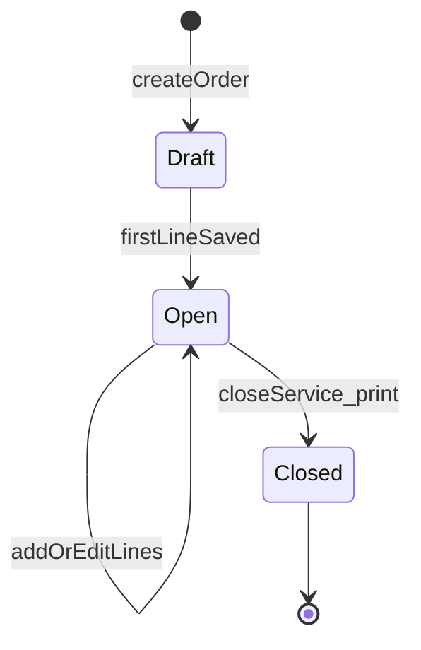
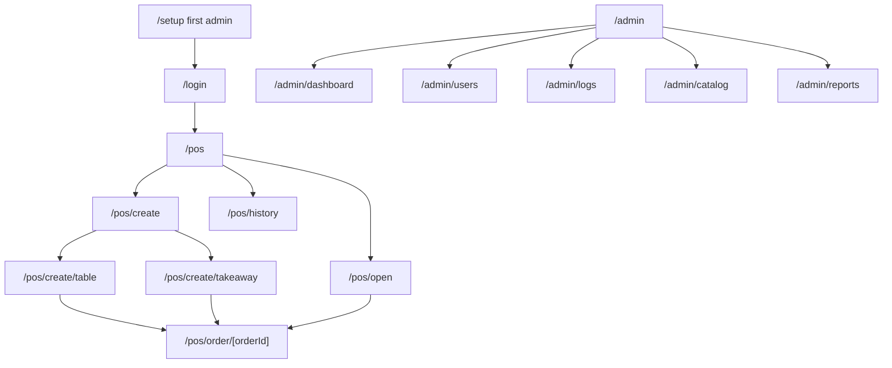

# iKassir — Product specification and technical plan

This document is the single source of truth for **what** we build (product) and **how** we implement it (technical plan) for the reception desktop POS **iKassir**.

---

## Part A — Product specification

### A.1 Purpose and context

**Goal:** A desktop app at the coffee shop reception for taking orders: dine-in (table) and take-away (pickup / delivery per settings), open-tab handling, internal receipt printing, basic administration, and reporting.

**Constraints (agreed):**

- Receipts are **internal only** (no fiscal / tax-register integration); fiscalization can be a later module if required.
- **Single PC** (single point of sale); no multi-terminal sync requirements.

**Platform:** Desktop **Electron.js**; UI and screen logic in **Next.js**.

---

### A.2 Glossary

| Term | Description |
|------|-------------|
| Super-user (root / admin) | Creates users, catalog, fees, tables; access to admin dashboard and logs |
| Staff | Orders and daily history only; no access to sensitive configuration |
| Order | A bill: table or take-away, line items, open/closed status |
| Open order | Unpaid / not closed; items can be added later |
| Close service | Confirm totals, print receipt, mark order **closed** (paid) per rules below |
| Modifier | Product options (size, shots, etc.) |

---

### A.3 Roles and permissions

| Action | Admin | Staff |
|--------|-------|-------|
| Login / logout | yes | yes |
| Create order, menu, cart | yes | yes |
| Open orders, today’s history | yes | yes |
| CRUD users | yes | no |
| CRUD categories / products / modifiers | yes | no |
| CRUD tables | yes | no |
| Service % and delivery fee settings | yes | no |
| Analytics, reports, logs, user tables | yes | no |

**First run:** Wizard to create the first admin user if no users exist.

---

### A.4 Master data and settings (admin)

- **Users:** login, display name, role, active/locked, password reset by admin.
- **Menu categories:** sort order, name, active flag.
- **Products:** name, price, category, active, image (optional, phase 2), link to modifier groups (0..N).
- **Modifiers:** group (e.g. “Size”), required yes/no, options (S/M/L) with surcharge on base price or price override — document pricing model in schema (recommendation: base product price + per-option surcharges).
- **Tables:** label/name, active, sort order.
- **Global settings:** **service fee %** for table orders; **delivery fee** for delivery mode (fixed or % — pick one in implementation); currency/display format; venue name on receipt.

---

### A.5 Pricing rules

- **Table:** Apply service fee X% on line subtotal; show subtotal, service, total in cart and on receipt.
- **Take-away — pickup:** No service fee by default.
- **Take-away — delivery:** Add **delivery fee** per admin setting (fixed fee recommended for simplicity).
- **Discounts / promos:** Out of scope for v1.

---

### A.6 Staff screens

#### Home after login

Nav bar: user name, **Logout**, **Create order** | **Open orders** | **Today’s history**. Large touch-friendly layout.

#### Create order

Two zones: **Take-away** | **Table**. Table → table picker → menu. Take-away → **Pickup** | **Delivery** → menu (no table).

#### Menu

Category tabs; product grid **4–5 per row**; modifier modal when needed; right **cart** with qty and delete; **Close service** (confirm, print, close order); navigate back with **auto-saved** lines.

#### Open orders

List → resume **menu** for `orderId`.

#### Today’s history

Day list; highlight open vs closed; click → receipt view + **Print**.

---

### A.7 Admin dashboard

Analytics (day / month / year + range in reports), users CRUD, audit logs, catalog CRUD, reports with CSV export / print summary.

---

### A.8 Logical data model (minimal)

- `User` (role, credentials, displayName, active)
- `Category`, `Product`, `ModifierGroup`, `ModifierOption`, M2M product–modifier groups
- `Table`
- `Order` (type: `table` | `takeaway_pickup` | `takeaway_delivery`, nullable `tableId`, status: `open` | `closed`, timestamps, `openedByUserId`, cached totals)
- `OrderLine` (product snapshot name/price, qty, JSON modifiers)
- `Setting` (key-value / typed rows)
- `AuditLog` (timestamp, userId, action, entity, JSON payload)

Indexes on `Order.openedAt`, `Order.status`.

---

### A.9 Receipt contents

Venue name, date/time, order number, type, staff; lines; subtotal, service, delivery, total; footer text from settings.

---

### A.10 Non-functional requirements

Performance (~500 SKUs), hashed passwords, DB transactions on close, auto-save cart, single UI language for MVP, auto-updater optional post-MVP.

---

### A.11 Delivery phases (product)

1. MVP POS: users, tables, simple catalog, table order + cart + open orders + close + basic print.  
2. Take-away modes + fees.  
3. Modifiers UI.  
4. Admin analytics, reports, logs, export.  
5. Hardening: ESC/POS, backups, screen lock.

---

### A.12 Sample acceptance criteria

- Admin creates staff, tables, catalog with options; sets service % and delivery fee.  
- Staff table order survives open-order round-trip.  
- Close service and receipt correct.  
- Today’s history and reprint behave as specified.  
- Admin analytics and date-range report work.

---

## Part B — Technical implementation plan

### B.1 Locked stack (defaults for the repo)

| Layer | Choice | Notes |
|-------|--------|------|
| Shell | **Electron** (current stable) | One `BrowserWindow` full-screen kiosk-style optional later |
| UI | **Next.js** ( **App Router** ) | Client-heavy POS; avoid relying on SSR to DB from renderer |
| Language | **TypeScript** everywhere | Shared types between main and renderer |
| DB | **SQLite** file under `app.getPath('userData')` | Single file `ikassir.db` |
| ORM | **Prisma** | Migrations checked in; `prisma generate` in CI/build |
| Passwords | **bcrypt** (or argon2 if preferred) | Only on main / server boundary, never in client-only bundles unguarded |
| Styling | **Tailwind CSS** + shared UI primitives | Match coffee-shop reception: large targets, clear hierarchy |
| Packaging | **electron-builder** | macOS target first (darwin per workspace); Windows can follow |

**Rationale:** Prisma + SQLite is fast to model and migrate. Keeping **database access in the Electron main process** avoids exposing Node/SQLite in the renderer and matches security best practice (`nodeIntegration: false`, `contextIsolation: true`).

---

### B.2 Electron ↔ Next.js integration

**Recommended production pattern:**

1. **Main process** holds Prisma client, path to SQLite, IPC handlers, print helpers.  
2. **Preload** exposes a typed **API surface** (e.g. `window.electron.api.orders.create(...)`) implemented with `ipcRenderer.invoke`.  
3. **Next.js** is built as a **static export** (`output: 'export'` in `next.config`) so the renderer is loaded via `file://` from `out/` inside the app bundle, **or** served from `loadURL` pointing to a **static file server** embedded in main if `file://` routing is painful — pick one during scaffold and document in README.

**Development:** Run Next dev server (`next dev`) and point `BrowserWindow` to `http://localhost:3000` with CORS/security dev flags documented; main still handles DB via IPC (preload must match prod API).

**Alternative (not default):** Run `next start` in main via child process on loopback — heavier; only if static export blocks required features.

---

### B.3 Security model

- `contextIsolation: true`, `nodeIntegration: false`, `sandbox: true` (Electron defaults where compatible).  
- Preload is the **only** bridge; whitelist IPC channels by name and validate payloads in main (zod or similar).  
- Session: after login, main can hold `currentUserId` + role for audit, or issue a short-lived signed token passed to renderer; simplest MVP: **session state in renderer** + **every IPC call includes userId** validated against last login — refine to main-held session table if needed.  
- **Minimum viable audit:** log login/logout and order lifecycle from main when IPC runs.

---

### B.4 IPC domains (sketch)

Group handlers by domain; each returns a typed result or structured error.

- `auth.login` / `auth.logout` / `auth.bootstrap` (check if any user exists)  
- `orders.create` / `orders.get` / `orders.listOpen` / `orders.listToday` / `orders.addLine` / `orders.updateLineQty` / `orders.removeLine` / `orders.close` (transaction)  
- `catalog.categories` / `catalog.products` / `catalog.modifiers` (read); admin mutations separate  
- `admin.users.*` / `admin.settings.*` / `admin.tables.*` / `admin.reports.*`  
- `print.receipt` (payload: orderId or snapshot HTML)  
- `system.dbPath` (dev only / support)

All mutating calls record `AuditLog` in main where applicable.

---

### B.5 Repository layout (proposed)

```text
ikassir/
  electron/
    main.ts              # app lifecycle, window, IPC registration
    preload.ts           # contextBridge expose API
    ipc/                 # handlers per domain
    db/                  # Prisma client singleton, migrations runner on startup
    services/            # order totals, pricing, receipt HTML
  src/                   # Next.js App Router (renderer)
    app/
      (auth)/login/
      (pos)/             # staff POS shell + nested routes
      (admin)/admin/     # admin routes, layout guard by role
    components/
    lib/                 # shared types, formatters, IPC client wrapper
  prisma/
    schema.prisma
  docs/
    TECHNICAL_SPEC.md
```

Shared **TypeScript types** for IPC payloads: `src/lib/ipc-contract.ts` duplicated or imported via a `packages/shared` workspace only if monorepo split is needed; start with **single package.json** and path imports from `electron/` into a `shared/` folder if TS project references allow.

---

### B.6 Order state machine



**Rules:** Only **Open** appears in “open orders”. **Closed** is immutable for lines (corrections = admin-only adjustment feature out of scope for v1). Totals on `Order` updated on each line change and recomputed on close in a transaction.

---

### B.7 Route map (App Router)



**Guards:** Middleware or layout client checks role from session; staff cannot hit `/admin/*`. Admin can use both `/pos/*` and `/admin/*`.

---

### B.8 Printing (MVP)

- Renderer requests `print.receipt` with `orderId`.  
- Main builds **HTML string** (template in `electron/services/receipt.ts`) and uses `webContents.print()` on a **hidden** `BrowserWindow` or `printToPDF` then system print — simplest path: load `data:` HTML in hidden window and call `print`.  
- Phase 2: ESC/POS bytes for thermal drivers.

---

### B.9 Build and release

- Scripts: `dev` (concurrently next dev + electron with `NODE_ENV=development`), `build` (next build static + compile electron TS + copy `out` into `dist`), `dist` (electron-builder).  
- Code signing: document placeholders for Apple Developer ID when distributing outside App Store.

---

### B.10 Testing strategy

- **Unit:** pricing/totals, modifier price resolution, receipt line formatting.  
- **Integration:** Prisma against temp SQLite file for order lifecycle IPC handlers (run in Node test runner).  
- **E2E (phase 2):** Playwright against packaged app or `electron-vite` test harness.

---

### B.11 MVP vs later (technical)

| Item | MVP | Later |
|------|-----|--------|
| DB in main + IPC | yes | — |
| Static Next export | yes | optional server mode |
| Print | HTML → system print | ESC/POS |
| Session | renderer + IPC user context | hardened main session, idle lock |
| Backups | manual export IPC | scheduled copy |
| i18n | English only | resource files |

---

### B.12 Next implementation steps (for developers)

1. Scaffold **Next.js** + **Tailwind** + **TypeScript** in repo root (or `src/`).  
2. Add **Electron** main/preload with secure defaults; dev URL to localhost.  
3. Add **Prisma** + initial schema matching §A.8; run migrations on app start if needed.  
4. Implement **IPC registry** + thin **client** in `src/lib/electron-api.ts`.  
5. Build **login + setup** flow.  
6. Implement **POS flows** per routes §B.7.  
7. **Admin** screens and reporting queries (SQL aggregations or Prisma raw).  
8. **electron-builder** pipeline and README.

---

### B.13 Related deliverables

- **README:** exact dev/prod commands, env vars (if any), platform notes.  
- Optional **ARCHITECTURE.md** if IPC/API surface grows beyond this file.

---

*Document version: 1.1 — product spec + technical plan (English).*
